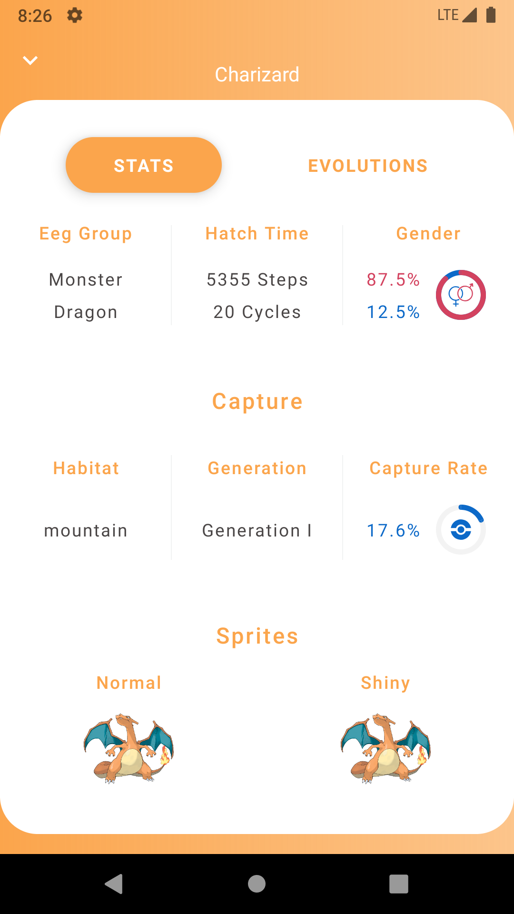

# PokeApp

Pokemon App. This app use pokemon api [https://pokeapi.co/docs/v2](https://pokeapi.co/docs/v2)

<table style="border-color:white;border-collapse:collapse;">
<tr style="border:none;">
<td style="border:none;"></td>
<td style="border:none;"></td>
<td style="border:none;"></td>
<td style="border:none;"></td>
</tr>
</table>

# Architecture

# MAD

[MAD Detail](https://madscorecard.withgoogle.com/scorecard/share/1583341189/)

